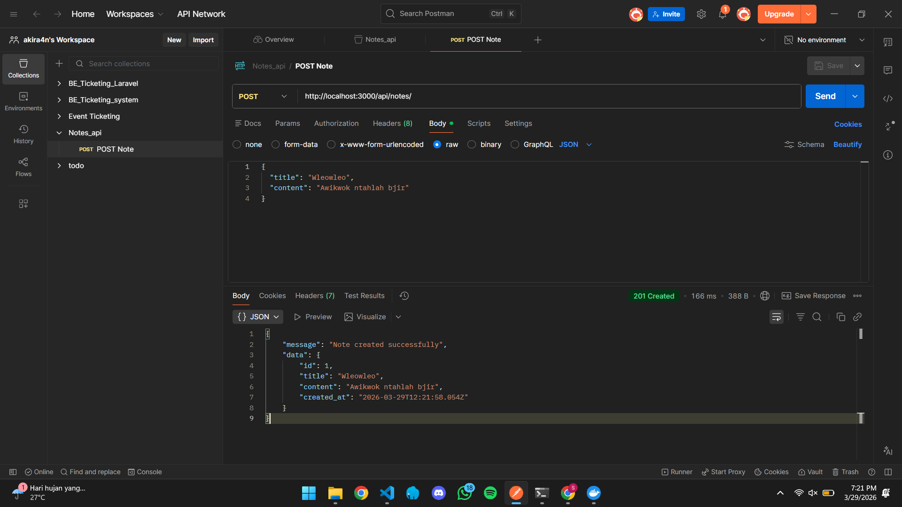
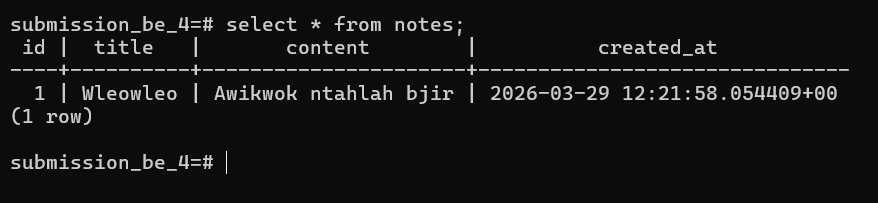

# Simple REST API With Express, PostgreSQL, and Docker

Simple REST API untuk mengelola catatan (Notes)

## 🛠️ Tech Stack

- **Runtime:** Node.js (v24 Alpine)
- **Framework:** Express.js
- **Database:** PostgreSQL (15-alpine)
- **Containerization:** Docker & Docker Compose

## 🚀 Cara Menjalankan Aplikasi

**Prerequirements**: **Docker** sudah terinstall.

1.  **Clone Repository**

    ```bash
    git clone https://github.com/akira4n/docker-rest-api-task.git
    cd docker-rest-api-task
    ```

2.  **Setup Environment Variables**

    ```bash
    cp .env.example .env
    ```

    Copy dan edit isi file `.env`

3.  **Run Services**

    ```bash
    docker compose up -d
    ```

4.  **Akses API**

    ```bash
    http://localhost:3000
    ```

---

## 📡 API Endpoints & Contoh Payload

| Method     | Endpoint         | Deskripsi                                                          | Request Body (JSON)                                    | Success Status |
| :--------- | :--------------- | :----------------------------------------------------------------- | :----------------------------------------------------- | :------------- |
| **GET**    | `/api/notes`     | Mengambil seluruh daftar catatan, diurutkan dari yang paling baru. | -                                                      | `200 OK`       |
| **POST**   | `/api/notes`     | Membuat data catatan baru.                                         | `{"title": "string", "content": "string"}`             | `201 Created`  |
| **PATCH**  | `/api/notes/:id` | Memperbarui sebagian data catatan berdasarkan parameter ID.        | `{"title": "string", "content": "string"}` _(opsional)_ | `200 OK`       |
| **DELETE** | `/api/notes/:id` | Menghapus data catatan berdasarkan parameter ID.                   | -                                                      | `200 OK`       |

### 1. Create a Note (POST)

`POST /api/notes`

**Request Body:**

```json
{
  "title": "Wleowleo",
  "content": "Awikwok ntahlah bjir"
}
```

**Response (201):**

```json
{
  "message": "Note created successfully",
  "data": {
    "id": 1,
    "title": "Wleowleo",
    "content": "Awikwok ntahlah bjir",
    "created_at": "2026-03-29T12:21:58.054Z"
  }
}
```

### 2. Get all Notes (GET)

`GET /api/notes`

**Response (200):**

```json
{
  "data": [
    {
      "id": 1,
      "title": "Wleowleo",
      "content": "Awikwok ntahlah bjir",
      "created_at": "2026-03-29T12:21:58.054Z"
    }
  ]
}
```

### 3. Edit a Note (PATCH)

`PATCH /api/notes/:id`

**Request Body:**

```json
{
  "title": "Ini adalah title yg udah di edit",
  "content": "Ini juga"
}
```

**Response (200):**

```json
{
  "message": "Note updated",
  "data": {
    "id": 1,
    "title": "Ini adalah title yg udah di edit",
    "content": "Ini juga",
    "created_at": "2026-03-29T12:21:58.054Z"
  }
}
```

### 4. Delete a Note (DELETE)

`DELETE /api/notes/:id`

**Response (200):**

```json
{
  "message": "Note deleted",
  "data": {
    "id": 1,
    "title": "Ini adalah title yg udah di edit",
    "content": "Ini juga",
    "created_at": "2026-03-29T12:21:58.054Z"
  }
}
```

## 💻 Screenshots




